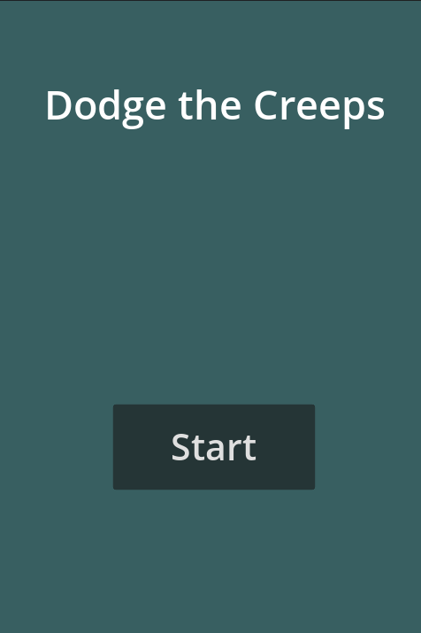
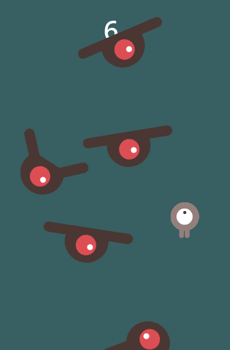

# Dodge the creeps

A sample game made using the Sagittarius game framework.

## Getting Started

To run the game you'll have to do the following:

1. Set project resolution to 480x720
    * Project > Project Settings > General tab > Display > Window
2. Run the game from the `Samples/Dodge the creeps/Game.tscn` scene
    1. Open `Samples/Dodge the creeps/Game.tscn`
    2. Select "Run Current Scene" or press F6

    or

    1. Right click `Samples/Dodge the creeps/Game.tscn` and select "Set As Main Scene"
    2. Select "Run Project" or press F5
